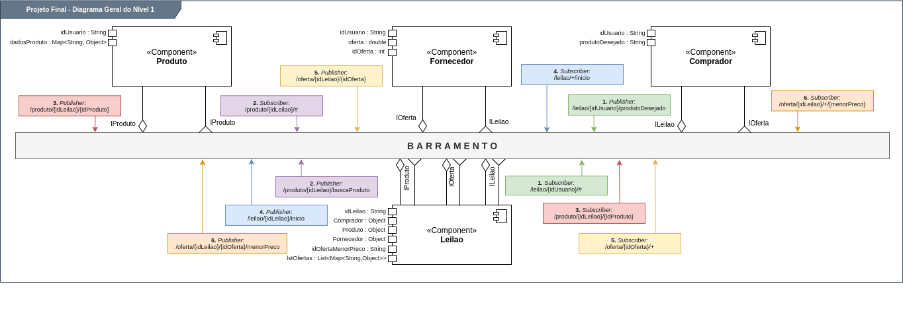
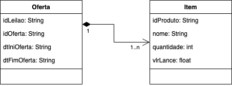
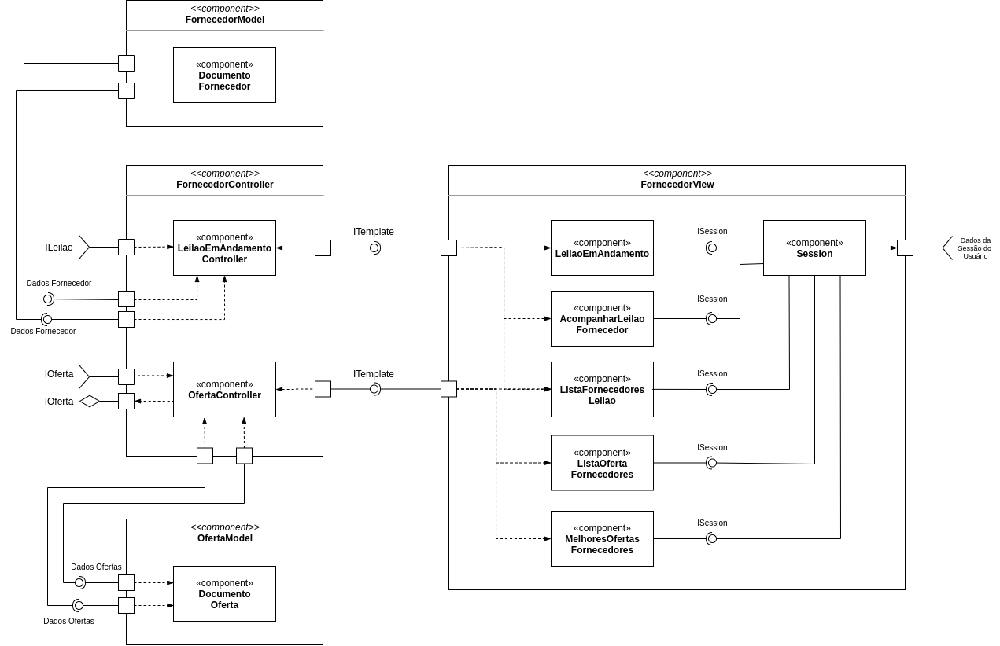

# Ranqueamento por Avaliação de Fornecedores e Leilão invertido

# Equipe
* eNove

### Membros
* Andrew Siqueira Guedes
* Fernando de Morais
* Rafael Mardegan Marquini
* Rodolfo Dalla Costa
* Ronaldo de Moraes Galvão

# Nível 1

## Diagrama Geral do Nível 1

É apresentado a seguir o diagrama contendo o modelo do barramento para o tema proposto:

> 

### Detalhamento da interação de componentes

1. O componente `Comprador` publica o tópico "`/leilao/{idUsuario}/produtoDesejado`" pela interface **ILeilao** que é subscrito pelo componente `Leilao`. Desta forma, há demonstração de interesse de um comprador por um produto;
2. O componente `Leilao` publica o tópico "`/leilao/{idLeilao}/buscaProduto`" pela interface **IProduto** que é subscrito pelo componente `Produto`. Assim, ocorre a interação Leilão - Produto pela interface **IProduto**;
3. O componente `Produto` publica o tópico pela interface **IProduto** "`/produto/{idLeilao}/{idProduto}`" que é subscrito pelo componente `Leilao`, novamente. Logo, um novo leilão poderá ser iniciado ou um em andamento será associado com este novo comprador;
4. O componente `Leilao` inicia o leilao publicando o tópico "`/leilao/{idLeilao}/inicio`" pela interface **ILeilao** que é subscrito pelo componente `Fornecedor`;
5. O componente `Fornecedor` publica o tópico "`/oferta/{idLeilao}/{idOferta}`" através da interface **IOferta** que é subscrito pelo componente `Leilao`, onde pelo _idLeilao_ aguarda distintas ofertas;
6. Por fim, o componente `Leilao` publica o tópico "`/oferta/{idLeilao}/{idOferta}/menorPreco`" através da interface **IOferta** que é subscrito pelo componente `Comprador`, que aguarda e irá receber o resultado do leilão.

## A seguir temos a descrição dos componentes:

### Componente `Comprador`

> Componente responsável pela iteração entre cliente e os leilões que ocorrem sobre o produto em que o cliente demonstra interesse. Recebe as atualizações dos lances realizados e comunica o cliente sobre os lances e os produtos disponíveis.

**Interfaces**  
> * ILeilao
> * IOferta

### Componente `Produto`

> Componente responsável por avaliar a disponibilidade dos produtos que irão entrar em leilão. Devolve lista de fornecedores que comercializam o produto e código do produto requisitado para leilão.

**Interfaces**  
> * IProduto

### Componente `Fornecedor`

> Fornecedor é acionado pelo Componente leilão, que informa o código do produto que irá entrar em leilão, avalia a quantidade de produtos disponíveis para leilão e realiza o lance do produto desejado pelo comprador.

**Interfaces**  
> * IOferta
> * ILeilao

### Componente `Leilao`

> O Componente Leilão é o orquestrador de todo o leilão que é relaizado. É o componente responsável por receber os interesses do componente Comprador, verifica a disponibilidade dos produtos, aciona a lista de fornecedores que comercializão o produto que irá para leilão. Recebe todos os lances realizados pelos fornecedores e encaminha para o comprador.

**Interfaces**  
> * IProduto
> * IOferta
> * ILeilao

## A seguir temos as interfaces uitlizadas:

### Interface ILeilao

Interface realiza o envio de dados do produto desejado pelo cliente ao componente Leilão. 
Comunica os fornecedores que comercialização o produto desejado.

**Tópico**: `leilao/{id}/produtoDesejado`

~~~json
{
    "idUsuario": "098234",
    "produtoDesejado":"Geladeira",
}
~~~

Detalhamento da mensagem JSON:

**ILeilao**
Atributo | Descrição
-------- | --------
idUsuario | Identificação do usuário
produtoDesejado | Identificador do produto desejado pelo comprador

**Tópico**: `leilao/{idLeilao}/inicio`

~~~json
{
    "idLeilao": "000001",
    "fornecedores": [
      { "idFornecedore": "001", "nome": "Brastemp" },
      { "idFornecedore": "002", "nome": "Lojas 100" },
      { "idFornecedore": "003", "nome": "Eletro Norte" },
      { "idFornecedore": "004", "nome": "Cibelar" },
    ],
    "produto": {
        "idProduto": "0123",
        "nome": "Geladeira"
    },
    "oferta_menor_preco":{
      "valor": 00.00
    }
}
~~~

**ILeilao**
Atributo | Descrição
------- | --------
idLeilao | Identificação do leilão
fornecedores | Array com lista de fornecedores
idFornecedore | Identificação do fornecedor
nome | Nome do fornecedor
produto | Objeto de produto
idProduto  | Identificação do Produto
nome | Nome do Produto

### Interface IOferta

Interface que faz o envio de dados do "lance" ofertado pelo `Fornecedor` que é recebido e orquestrado pelo componente `Leilao`, que por sua vez disponibiliza a mensagem para o componente `Comprador`priorizando os menores valores "lance" ofertados.

**Tópicos**:
> * `oferta/{idLeilao}/{idOferta}/menorPreco` 
> * `oferta/{idLeilao}/{idOferta}`

~~~json
{
  "idLeilao": "000001",
  "idOferta": "000001",
  "dtIniOferta": "2020-09-18T21:20:00Z",
  "dtFimOferta": "2020-09-20T21:20:00Z",
  "produtos": [
    {
      "idProduto": "0123",
      "nome": "Geladeira",
      "quantidade": 1,
      "vlrLance": 3999.99
    }
  ]     
}
~~~

Detalhamento da mensagem JSON:

**Oferta**
Atributo | Descrição
-------| --------
idLeilao | número do leilão que requisitou o produto
idOferta | número da oferta
dtIniOferta | data de requisicao
dtFimOferta | itens do pedido
produtos | itens ofertados

**Item**
Atributo | Descrição
-------| --------
idProduto | identificador do item
nome | nome do item
quantidade | quantidade do item
vlrLance | valor da oferta

### Interface IProduto

Interface para comunicação entre `Leilao` e `Produto`, utilizada pelo componente `Leilao` para início do processo de validação de disponibilidade de um produto e pelo componente `Produto` para retorno de detalhes e lista de fornecedores.

**Tópico**: `leilao/{idLeilao}/buscaProduto`

~~~json
{
  "idLeilao": "000001",
  "produtoDesejado": "Geladeira",
}
~~~

Detalhamento da mensagem JSON:

**Consulta**  

Atributo | Descrição
-------| --------
idLeilao | número do leilão que requisitou o produto
produtoDesejado | palavras chave para localização do produto

**Tópico**: `produto/{idLeilao}/{idProduto}`

~~~json
{
  "idLeilao": "000001",
  "produto": {
    "idProduto": "0123",
    "nome": "Geladeira"
  },
  "fornecedores": [
    { "idFornecedore": "001", "nome": "Brastemp" },
    { "idFornecedore": "002", "nome": "Lojas 100" },
    { "idFornecedore": "003", "nome": "Eletro Norte" },
    { "idFornecedore": "004", "nome": "Cibelar" },
  ]
}
~~~

Detalhamento da mensagem JSON:

**Retorno**
Atributo | Descrição
-------| --------
idLeilao | número do leilão que requisitou o produto
produto | detalhes do produto solicitado
fornecedores | listagem dos fornecedores do produto

**Produto**
Atributo | Descrição
-------| --------
idProduto | número único do produto
nome | nome do produto normalizado

**Fornecedor**
Atributo | Descrição
-------| --------
idFornecedor | número único do fornecedor
nome | nome do fornecedor cadastrado no sistema

# Nível 2

## Diagrama do Nível 2

É apresentado a seguir o diagrama contendo o modelo das camadas `Model`, `View` e `Controller` para o tema proposto neste projeto:

> 

### Detalhamento das interação que envolvem o LeilaoEmAndamentoController

* O componente `Leilao` assina no barramento mensagens de tópico "`leilao/{idUsuario}/produtoDesejado`" através da interface **ILeilao**.
  * Ao receber uma mensagem de tópico "`leilao/{idUsuario}/produtoDesejado`", dispara o início da validação de disponibilidade de um produto puclicado pelo componente `Comprador`.
* O componente `Leilao` publica a mensagem `/leilao/{idLeilao}/buscaProduto` que assinada pelo comonente `Produto` e devolvidade para o componente `Leilao` que assina `produto/{idLeilao}/buscaProduto}` 
* O componente `Fornecedor` assina no barramento a mensagem de tópico `leilao/{idLeilao}/inicio` através da interface **IOferta** com componente `Leilao`, que  publica o topico `oferta/{idLeilao}/{idOferta}/menorPreco`  no barramento, finalizando assim o percurso iniciado pelo comprador.

## Componente `LeilaoEmAndamentoController`

Componente responsavel por filtrar os dados recebidos da interface ILeilao, recuperar as informacoes em cache ou no banco referente aos dados recebidos e transformar no `ITemplate` para o view.

**Interfaces**
> * ITemplate
> * ILeilao

As interfaces listadas são detalhadas a seguir:

## Detalhamento das Interfaces

### Interface `ITemplate`

> A Interface Itemplate reune um montante de informacoes que sao importantes para o fornecedor e que podem ser gerenciadas em sua maioria pelo proprio model do fornecedor. Utilizada para se comunicar para com a view.

Detalhamento do json:
~~~json
{
  "MenorOferta": 10.10,
  "SuaUltimaOferta": 09.09,
  "MelhorOfertaEhSua": false,
  "TempoDesdeUltimaOferta": "00:05:13",
  "produto":{
    "idProduto" : "0001",
    "nome": "Geladeira",
    "qtdEstoque": 3,
    "imgProduto": "example.com/<idLocalizacao>"
  }
}
~~~

Método | Objetivo
-------| --------
`MenorOferta` | `Valor da menor oferta em leilao`
`SuaUltimaOferta` | `Valor da ultima oferta feita pelo fornecedor em leilao (caso nao tenha feito nenhuma o valor eh negativo`
`MelhorOfertaEhSua` | `Indicador que determina se a melhor oferta do leilao pertence ao fornecedor`
`TempoDesdeUltimaOferta` | `Tempo decorrido desde seu ultimo lance`
`produto` | `Informacoes sobre o Produto como Id, nome entre outras.`

# Multiplas Interfaces

No desenho da arquitetura foi utilizado MVC e a interface ITemplate que será utilizada para definição dos objetos de comunicação entre os controllers e as diversas implementações de interface.

Para possibilitar o chaveamento das Views para as plataformas Web e Mobile será utilizado o design pattern abstract factory.

A seguir segue o diagrama do componente `ListaOfertaFornecedores` que exemplifica essa implementação.

Neste diagrama temos a interface `IInterfaceComponentFactory` que define os métodos de factory de componentes para utilização nas diversas implementações concretas, exemplificadas no diagrama para web e mobile pelas classes concretas `WebComponentFactory` e `MobileComponentFactory`. As classes concretas são responsáveis, através da implementação de `IInterfaceComponentFactory`, por definir os métodos necessários para criar os componentes em suas plataformas específicas.

