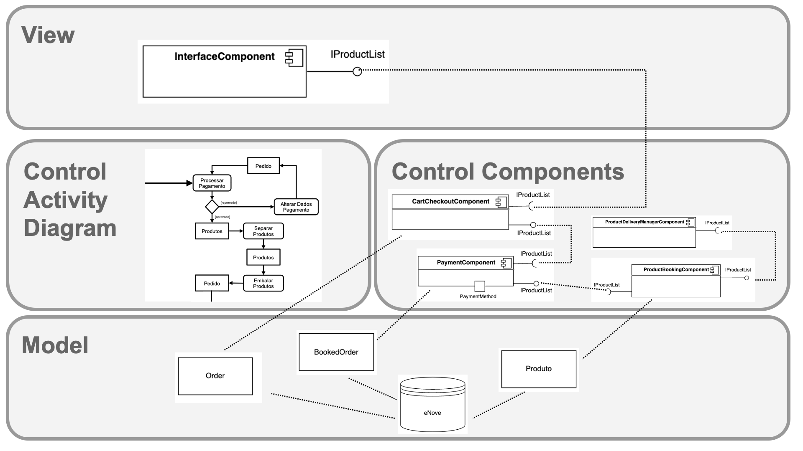
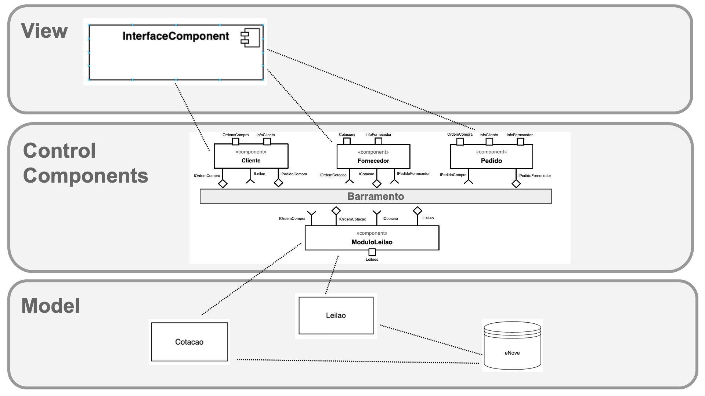

# Lab03 - Model-View-Controller

---

## Tarefa 4

Tarefa a ser feita com a equipe do trabalho:
Usando o espaço que separa o MVC, detalhe os diagramas das Tarefas 1 e 2, da seguinte maneira:

* considere que os diagramas que você fez fazem parte do Controller;
* detalhe mais componentes referentes ao Model e ao View;
* defina como será a interação entre esses componentes.

### Model View Controller com Workflow

### Model View Controller com Coreografia

---

## Referências

No link do Google Drive [modelo](https://docs.google.com/presentation/d/1UMC749wjVD1aRUSH1OuiT006SkXqYUjedhL8fZJd6xY/edit?usp=sharing) ou no diretório [resources/ @ santanche/component2learn](https://github.com/santanche/component2learn/blob/master/labs/03-mvc/resources) você encontrará um modelo para resolver as tarefas 1 e 2.